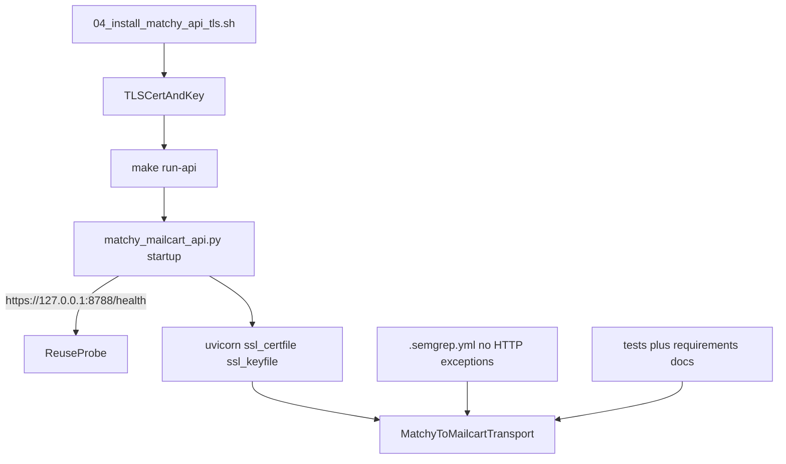

# Enforce HTTPS-Only in Mailcart

## Goal
Apply the same hardening intent as Teller’s `enforce-https-everywhere` plan to this repo: Mailcart must run over HTTPS and disallow HTTP everywhere, with fail-fast startup when TLS config is missing.

## Key Current Gaps
- Runtime API starts as plain HTTP in [`/Users/phil/local/src/mailcart/scripts/matchy_mailcart_api.py`](/Users/phil/local/src/mailcart/scripts/matchy_mailcart_api.py):

```232:257:/Users/phil/local/src/mailcart/scripts/matchy_mailcart_api.py
if in_use:
    ...
    probe = requests.get("http://127.0.0.1:8788/health", timeout=1.5)
...
uvicorn.run(app, host="127.0.0.1", port=8788)
```

- `make run-api` has no TLS orchestration in [`/Users/phil/local/src/mailcart/Makefile`](/Users/phil/local/src/mailcart/Makefile).
- SAST currently permits localhost HTTP via `.semgrep.yml` in [`/Users/phil/local/src/mailcart/.semgrep.yml`](/Users/phil/local/src/mailcart/.semgrep.yml).
- Docs still describe HTTP transport and include `http://localhost` guidance in [`/Users/phil/local/src/mailcart/README.md`](/Users/phil/local/src/mailcart/README.md).

## Implementation Plan

### 1) Add TLS bootstrap script and env contract (Teller-style orchestration)
- Add new script at [`/Users/phil/local/src/mailcart/04_install_matchy_api_tls.sh`](/Users/phil/local/src/mailcart/04_install_matchy_api_tls.sh) modeled on Teller’s `04_install_classifier_api_tls.sh` behavior:
  - defaults for TLS dir/cert/key under user home,
  - idempotent cert reuse,
  - optional force-regenerate flag,
  - `mkcert`-based localhost cert generation,
  - strict file permissions.
- Update [`/Users/phil/local/src/mailcart/01_install_prerequisites.sh`](/Users/phil/local/src/mailcart/01_install_prerequisites.sh) to ensure `mkcert` is available.
- Define Mailcart-specific env vars for TLS paths (cert/key/dir and optional regenerate switch) and use them consistently in scripts/docs.

### 2) Enforce HTTPS-only runtime with fail-fast startup
- Update [`/Users/phil/local/src/mailcart/scripts/matchy_mailcart_api.py`](/Users/phil/local/src/mailcart/scripts/matchy_mailcart_api.py):
  - require configured cert/key before server start,
  - fail with explicit error when TLS material is missing,
  - switch reuse probe to `https://127.0.0.1:8788/health`,
  - run uvicorn with `ssl_certfile` and `ssl_keyfile` so API is HTTPS-only.
- Keep bind on `127.0.0.1:8788` unless separately requested; only transport changes.
- Update [`/Users/phil/local/src/mailcart/Makefile`](/Users/phil/local/src/mailcart/Makefile) `run-api` path to orchestrate TLS bootstrap before launching API.

### 3) Remove policy-level HTTP allowances
- Tighten [`/Users/phil/local/src/mailcart/.semgrep.yml`](/Users/phil/local/src/mailcart/.semgrep.yml) rule `no-production-http-endpoint` to disallow localhost/127.0.0.1 HTTP exceptions.
- Keep explicit non-runtime exception for Apple DTD if needed.

### 4) Rewrite docs/requirements to HTTPS-only
- Update [`/Users/phil/local/src/mailcart/README.md`](/Users/phil/local/src/mailcart/README.md):
  - replace HTTP transport references with HTTPS,
  - remove `http://localhost` guidance and use a no-HTTP OAuth setup path,
  - add TLS bootstrap + cert/key requirements for `make run-api`.
- Update requirements docs:
  - [`/Users/phil/local/src/mailcart/requirements/matchy_mailcart_api-requirements.md`](/Users/phil/local/src/mailcart/requirements/matchy_mailcart_api-requirements.md)
  - [`/Users/phil/local/src/mailcart/requirements/Makefile-requirements.md`](/Users/phil/local/src/mailcart/requirements/Makefile-requirements.md)
- Add/adjust requirement IDs describing HTTPS-only transport and fail-fast TLS startup.

### 5) Add tests for HTTPS default + HTTP disallowance
- Extend [`/Users/phil/local/src/mailcart/tests/python/test_matchy_mailcart_api.py`](/Users/phil/local/src/mailcart/tests/python/test_matchy_mailcart_api.py):
  - assert startup path uses HTTPS probe URL,
  - assert startup rejects missing TLS config,
  - assert uvicorn is invoked with SSL cert/key parameters.
- Add/update shell tests in [`/Users/phil/local/src/mailcart/tests/sh/matchy_mailcart_api.bats`](/Users/phil/local/src/mailcart/tests/sh/matchy_mailcart_api.bats) and/or [`/Users/phil/local/src/mailcart/tests/sh/Makefile.bats`](/Users/phil/local/src/mailcart/tests/sh/Makefile.bats) to verify TLS bootstrap orchestration and no HTTP startup behavior.
- Include explicit negative checks that `http://127.0.0.1:8788` is not treated as valid runtime transport.

### 6) Validate hardening outcome
- Run focused lanes:
  - updated Python unit tests for Matchy API,
  - shell/BATS tests touching `make run-api` and TLS bootstrap,
  - targeted Semgrep rule validation.
- Run repository search for `http://` and verify only intentionally non-transport literals remain.



## Notes / Risk
- This is intentionally breaking for local setups that relied on HTTP; developers must install/generate certs before `make run-api`.
- Because you requested strict no-HTTP, docs/config will remove the previous `http://localhost` guidance as part of this change.
