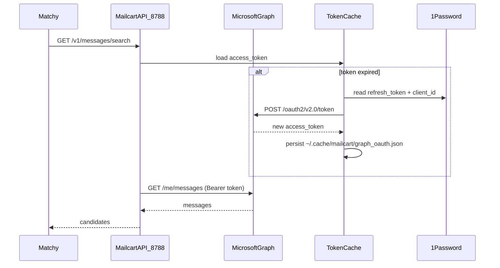

# Graph Token Auto-Refresh for Mailcart

## Root cause

Mailcart currently treats Microsoft Graph auth as a **static bearer token** with no renewal:

- Device-code setup in [README.md](README.md) requests `offline_access` but **only stores `access_token`** in 1Password — the `refresh_token` is discarded.
- Access tokens expire in ~1 hour.
- [`scripts/matchy_mailcart_api.py`](scripts/matchy_mailcart_api.py) reads the token once (your in-progress `_CACHED_PSA_TOKEN` change makes this worse by never re-reading 1Password).
- The native bridge in [`macos_app/Bridge/OutlookClientBridge.mm`](macos_app/Bridge/OutlookClientBridge.mm) reads `OUTLOOK_GRAPH_TOKEN` from env **once at process start** via `ResolveGraphToken()`.

When Matchy runs a match or Match Review searches Mailcart, Graph calls fail silently or return empty — e.g. "No candidates recorded" for an obvious DoorDash match.

## Solution

Introduce a **shared token manager** that:

1. Bootstraps from 1Password: `refresh_token` + optional stale `access_token`, plus `OUTLOOK_GRAPH_CLIENT_ID` from env.
2. Persists the live session to **`~/.cache/mailcart/graph_oauth.json`** (access_token, refresh_token, expires_at).
3. **Proactively refreshes** when `expires_at` is within 5 minutes (decode JWT `exp` or use `expires_in` from token response).
4. **Reactively refreshes** on Graph **401**, then retries the request once.
5. Is used by **both** the Python API and the native macOS bridge.

Revert the current `_CACHED_PSA_TOKEN` caching — it prevents recovery even after manual 1Password updates.

## Implementation

### 1. New module: [`scripts/graph_token.py`](scripts/graph_token.py)

Core `GraphTokenManager` with:

| Function | Behavior |
|----------|----------|
| `load()` | Read disk cache; if missing/expired, bootstrap from 1psa fields |
| `get_access_token()` | Return valid token; refresh if needed |
| `refresh(force=False)` | POST to `https://login.microsoftonline.com/common/oauth2/v2.0/token` with `grant_type=refresh_token` |
| `invalidate()` | Clear in-memory state (called on 401 before forced refresh) |
| `persist()` | Atomic write to `~/.cache/mailcart/graph_oauth.json` (mode 0600) |

**1Password fields** (item `outlook_graph_token`, overridable via existing env vars):

| Field | Env override | Purpose |
|-------|--------------|---------|
| `password` | `OUTLOOK_GRAPH_TOKEN_PSA_FIELD` | Bootstrap access_token (optional once cache exists) |
| `refresh_token` | `OUTLOOK_GRAPH_TOKEN_PSA_REFRESH_FIELD` (new, default `refresh_token`) | Long-lived refresh credential |
| — | `OUTLOOK_GRAPH_CLIENT_ID` | Azure app client ID (required for refresh) |

JWT expiry: base64-decode payload `exp` (no signature verification needed — only used to decide when to refresh).

### 2. CLI helper: [`scripts/refresh_graph_token.py`](scripts/refresh_graph_token.py)

Thin wrapper: `python3 scripts/refresh_graph_token.py [--force]`

- Used by native bridge on 401
- Can be run manually or via launchd every ~45 min as belt-and-suspenders
- Exits 0 + prints nothing on success; exits non-zero with actionable stderr on failure

### 3. Update [`scripts/matchy_mailcart_api.py`](scripts/matchy_mailcart_api.py)

- Replace `_graph_token()` / `_CACHED_PSA_TOKEN` with `GraphTokenManager.get_access_token()`.
- Wrap `_graph_get` / `_graph_post`: on 401 → `invalidate()` → `refresh(force=True)` → retry once.
- Enhance `/health` to report token status: `{"status":"ok","token_expires_at":"..."}` or `"token_status":"missing_refresh_token"`.
- Fix search auth masking: if the fallback fetch also fails with 401/502 auth error, return **502 with explicit auth detail** instead of appearing as an empty mailbox (lines 132–133 currently swallow `$search` failures indiscriminately — distinguish auth failures from search-syntax failures).

### 4. Update native bridge: [`macos_app/Bridge/OutlookClientBridge.mm`](macos_app/Bridge/OutlookClientBridge.mm)

- Change `ResolveGraphToken()` to prefer valid token from `~/.cache/mailcart/graph_oauth.json`, fall back to `OUTLOOK_GRAPH_TOKEN` env.
- In `FetchGraphGetData` / `FetchGraphRequestData`: on HTTP **401**, synchronously exec `python3 <repo>/scripts/refresh_graph_token.py`, re-read cache, **retry once**.
- Keep existing auth error strings (`InvalidAuthenticationToken`, etc.) so [`OutlookMailViewModel.swift`](macos_app/UI/OutlookMailViewModel.swift) guidance still works.

Repo path for refresh script: resolve relative to app bundle or use env `MAILCART_REPO_ROOT` (set by `make run`).

### 5. Update [`Makefile`](Makefile)

- Export `OUTLOOK_GRAPH_CLIENT_ID` and `MAILCART_REPO_ROOT` in `run` and `run-api` targets.
- Optionally call `refresh_graph_token.py` before launching app/API to warm the cache.

### 6. Docs and requirements

- [README.md](README.md) Step 2: extract and store **`refresh_token`** alongside access_token; document `OUTLOOK_GRAPH_CLIENT_ID`; fix scope to include `Mail.ReadWrite`.
- [requirements/matchy_mailcart_api-requirements.md](requirements/matchy_mailcart_api-requirements.md): add R026–R030 for refresh, retry-on-401, cache persistence, health token status.
- [requirements/Bridge-requirements.md](requirements/Bridge-requirements.md): update R015 to include cache-file resolution and 401 refresh retry.

### 7. Tests

- New unit tests for `graph_token.py` with mocked token endpoint (valid refresh, expired refresh, missing client_id).
- Extend [`tests/sh/matchy_mailcart_api.bats`](tests/sh/matchy_mailcart_api.bats) traceability tags for new requirements.

## One-time migration (manual, after deploy)

1. Re-run device-code flow from README (or use existing refresh_token if you saved it).
2. Store in 1Password item `outlook_graph_token`:
   - `password` → access_token
   - `refresh_token` → refresh_token (new field)
3. Set `OUTLOOK_GRAPH_CLIENT_ID` in shell profile or `.env`.
4. Run `python3 scripts/refresh_graph_token.py` to populate cache.
5. Restart `make run-api` (kill existing process on 8788 if stale).

After this, tokens refresh automatically for hours/days until the refresh_token itself expires (~90 days), at which point re-run device-code flow once.

## Out of scope

- MSAL library dependency (unnecessary for this single-tenant local tool).
- Writing refreshed tokens back to 1Password via `op` CLI (1psa is read-only; disk cache is sufficient).
- Changes to Matchy/Teller repos (they will benefit automatically once Mailcart API returns real results again).

## Risk notes

- Refresh token rotation: Microsoft may issue a new refresh_token on each refresh — always persist the latest one to the cache file.
- Long-running API process on 8788: after deploy, **restart the existing API process** so it picks up the new token manager code.
