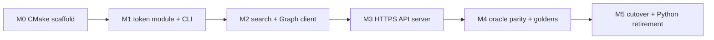

# Mailcart Python → C++ Migration

## Context

Mailcart is already mostly native (Swift UI, ObjC++bridge, C++17 `cpp_core/`). The Python that remains is:

- [scripts/matchy_mailcart_api.py](scripts/matchy_mailcart_api.py) (~683 LOC) — FastAPI HTTPS API on `127.0.0.1:8788` (`/health`, `/v1/messages/search`, `/v1/messages/{id}`, `POST /v1/messages/{id}/move`), Aho-Corasick scoped search, Graph HTTP, write-token auth
- [scripts/graph_token.py](scripts/graph_token.py) (~~334 LOC) — `GraphTokenManager`: 1psa bootstrap, JWT expiry check, refresh, cache at `~~/.cache/mailcart/graph_oauth.json`
- [scripts/refresh_graph_token.py](scripts/refresh_graph_token.py) (~37 LOC) — CLI also invoked by the ObjC++ bridge on 401
- [dast_app.py](dast_app.py) (~69 LOC) — TLS uvicorn wrapper for the DAST lane

Key constraint: matchy ([../matchy/matchy/mailcart_client.py](../matchy/matchy/mailcart_client.py)) and classy consume mailcart **over HTTPS only** — no Python imports. So unlike teller (blocked on importers), mailcart can do a **full classy-style Python retirement**, but the end state is a **cpp-httplib TLS server** preserving the `/v1/messages/`* contract, not an in-process FFI. The core is still built as a library (`mailcartcore`) with the server as a thin tool, which keeps the eggnest roadmap RM-T-023 in-process consolidation path open.

## Approach (family template from classy/teller)

- CMake 3.24+, C++20, `-Wall -Wextra -Wpedantic -Werror`, FetchContent: nlohmann/json 3.11.3, cpp-httplib 0.18.3 (+OpenSSL), Catch2 3.7.1; libFuzzer via Homebrew LLVM
- Live Python/C++ oracle parity first, then freeze goldens, then delete Python
- Test lanes: t15 Catch2 unit, t16 ASan+UBSan, t17 oracle parity; libFuzzer replaces Hypothesis; retire pytest/mutmut lanes at the end

## Phases

### M0 — Scaffold

- Add `CMakeLists.txt` building `libmailcartcore.a` plus tests/tools. Recommended: keep the existing `cpp_core/` location (already wired into Xcode via [macos_app/project.yml](macos_app/project.yml) and `make _bridge-check`/`_cpp-test`) rather than relocating to `src/core/`; fold existing sources (`outlook_client`, `mailcart`, `mime_content`) into the CMake target.
- Migrate the existing custom-harness C++ tests to Catch2; add root `Makefile` targets (`core`, `core-test`, `sanitize`, `parity`) following classy's facade style.

### M1 — Token lifecycle (port `graph_token.py`)

- `token.cpp`: 1psa secret bootstrap (reuse teller's `onepsa.cpp` dlopen pattern from [../teller/src/core/src/onepsa.cpp](../teller/src/core/src/onepsa.cpp)), JWT expiry via base64url + nlohmann/json, refresh POST to `login.microsoftonline.com` via cpp-httplib client, cache read/write **format-compatible** with `~/.cache/mailcart/graph_oauth.json` (shared with the bridge).
- New CLI tool `mailcart_token` replacing `refresh_graph_token.py`; update the ObjC++ bridge 401 hook to invoke it.
- Catch2 tests mirroring [tests/python/test_graph_token.py](tests/python/test_graph_token.py) (cache round-trip, expiry, refresh paths).

### M2 — Search + Graph client (port the API's domain logic)

- `aho_corasick.cpp` (scoped search matcher), `graph_client.cpp` (search/read/move against Graph v1.0), payload mapping into the existing `OutlookMailcart` model where it fits.
- Catch2 tests mirroring the matcher/mapping subset of [tests/python/test_matchy_mailcart_api.py](tests/python/test_matchy_mailcart_api.py).

### M3 — HTTPS API server (port `matchy_mailcart_api.py`)

- `server.cpp` + `mailcart_api` binary: cpp-httplib `SSLServer` using the existing mkcert certs (`~/.mailcart/matchy-localhost-*.pem`), write-token auth, identical routes/status codes/JSON shapes including error envelopes (matchy's client depends on them).
- Check in a static OpenAPI spec (export once from FastAPI) so the Schemathesis DAST lane keeps a contract source after FastAPI is gone.

### M4 — Oracle parity (t17) and fuzz

- `compare_oracle.py`-style harness: a stub Graph upstream serving canned fixtures; drive identical request scenarios through the FastAPI app and `mailcart_api`, normalize (timestamps, token metadata), diff with an allowlist; then freeze `goldens.json` and add a pure-C++ replay mode, per classy's [../classy/.cursor/plans/python_oracle_retirement_0809a8f1.plan.md](../classy/.cursor/plans/python_oracle_retirement_0809a8f1.plan.md).
- libFuzzer targets: query parsing, Aho-Corasick, Graph payload mapping (replaces Hypothesis t10).
- Integration smoke: matchy's client against the C++ server (`make stack` path in classy already exercises mailcart).

### M5 — Cutover and Python retirement

- `make run-api` launches `mailcart_api`; retarget DAST lane t11 from `dast_app.py` to the C++ server.
- Delete `scripts/*.py`, `dast_app.py`, `tests/python/`, venv/pip lockfiles and bootstrap scripts 02–04; retire lanes t06 (unittest), t07 (mutmut), t10 (Hypothesis); add t15/t16/t17; carry `#R###` traceability tags into C++ tests so lane t04 stays green.
- Update [../runner/config/runbook/mailcart.env](../runner/config/runbook/mailcart.env) (drop Python prereqs/knobs, add cmake), [Architecture.md](Architecture.md), README, and CI ([.github/workflows/ci.yml](.github/workflows/ci.yml) → Linux-portable cmake/ctest subset, as classy did).

## Risks / notes

- The token cache file and TLS cert paths are shared contracts with the bridge and matchy — byte-format compatibility is part of parity, not an afterthought.
- Graph is an external service, so parity runs against a recorded/stubbed upstream; the existing replay fixtures in `macos_app/Bridge` tests (t16 lane) can seed the canned Graph responses.
- The unused `psycopg2`/`sqlalchemy` pins in [requirements.in](requirements.in) disappear with the lockfile; no DB work is involved.
- Python stays fully alive and green (lanes t00–t14) until M4 parity passes — same coexistence rule as teller.

